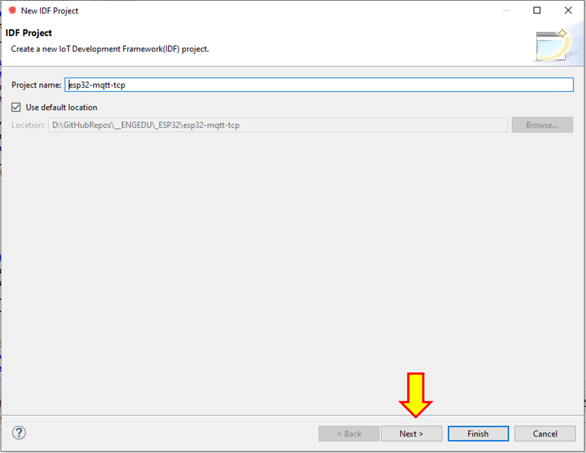

# MQTT_Lab_I
การทดลอง MQTT ตอนที่ 1  การใช้ ESP32 เป็น MQTT Subscriber

# 1. การทดลอง

## 1.1 กำหนด requirement และ scenario ของโปรเจค

การทดลองนี้ จะใช้ ESP32 ในการทำหน้าที่ subscriber ไปยัง MQTT BROKER โดยสมมติว่าเราใช้ ESP32 ควบคุมหลอดไฟฟ้าในบ้าน (ใช้ LED1 เป็นตัวแสดงผล)
การควบคุมหลอดไฟในบ้าน จะทำได้ 2 กรณีคือ สั่งการจาก MQTT Explorer และ MQTT Dashboard

ในการทดลองนี้เราจะใช้ MQTT BROKER  สาธารณะ  เนืองจากไม่จำเป็นต้องมีการตอบสนองแบบทันทีทันใดเหมือน Broker ส่วนตัว

ดังนั้นให้ตั้งชื่อ topic ของแต่ละคนเป็น MYHOME-<nnn> โดย <nnn> คือเลขสามตัวท้ายของรหัสนักศึกษา


## 1.2 สร้าง Project

### 1.2.1 สร้าง project ใหม่จากเทมเพลต `MQTT` -> `tcp`




### 1.2.2 ตั้งชื่อ `esp32-mqtt-tcp`


### 1.2.3 ตรวจสอบ code
esp-idf  จะสร้าง code  เบื้องต้นมาให้ ให้ศึกษา code ให้เข้าใจ

```c
...
void app_main(void)
{
    ...

    ESP_ERROR_CHECK(nvs_flash_init());
    ESP_ERROR_CHECK(esp_netif_init());
    ESP_ERROR_CHECK(esp_event_loop_create_default());

    /* This helper function configures Wi-Fi or Ethernet, as selected in menuconfig.
     * Read "Establishing Wi-Fi or Ethernet Connection" section in
     * examples/protocols/README.md for more information about this function.
     */
    ESP_ERROR_CHECK(example_connect());

    mqtt_app_start();
}
```

จากโปรแกรมต้วอย่าง นักศึกษาจะไม่เห็น function ที่ main() เรียกใช้ ซึ่ง function เหล่านั้นจะถูกดึงเข้ามาในขั้นตอนการ build ซึ่งสามารถเปิดไฟล์  CMakeList.txt ใน root ของ project ดูได้ว่า esp-idf เอามาจากที่ไหน

``` cmake
# The following four lines of boilerplate have to be in your project's CMakeLists
# in this exact order for cmake to work correctly
cmake_minimum_required(VERSION 3.5)

# (Not part of the boilerplate)
# This example uses an extra component for common functions such as Wi-Fi and Ethernet connection.
set(EXTRA_COMPONENT_DIRS $ENV{IDF_PATH}/examples/common_components/protocol_examples_common)

include($ENV{IDF_PATH}/tools/cmake/project.cmake)
project(mqtt_tcp)

```


## 1.3 กำหนดค่า configuration


## 1.4 แก้ไข code


## 1.5 ทดสอบการทำงาน 


## 1.6 วิเคราะห์และสรุปผล 


## <<<บันทึกผลที่ได้>>> 


##  [>> หัวข้อต่อไป >>](./MQTT_Sheet_lab_2.md) 