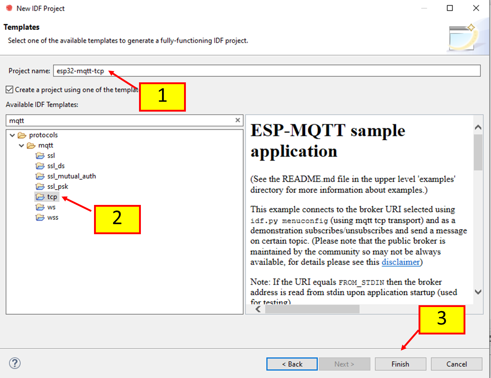
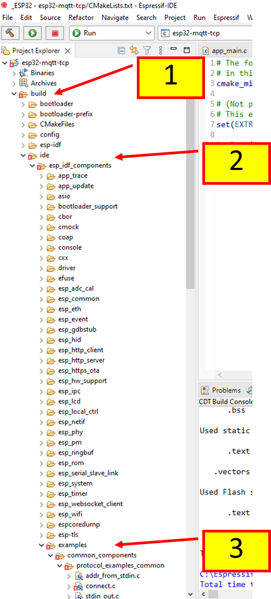
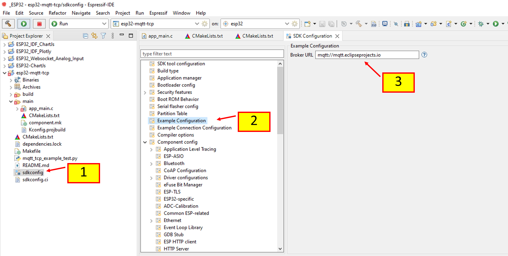
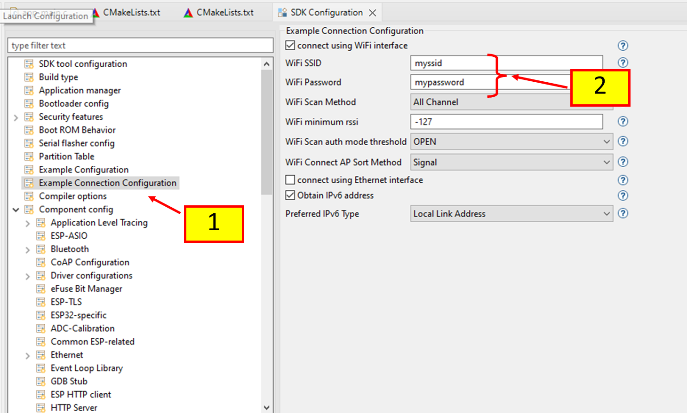

# MQTT_Lab_I
การทดลอง MQTT ตอนที่ 1  การใช้ ESP32 เป็น MQTT Subscriber

# 1. การทดลอง

## 1.1 กำหนด requirement และ scenario ของโปรเจค

การทดลองนี้ จะใช้ ESP32 ในการทำหน้าที่ subscriber ไปยัง MQTT BROKER โดยสมมติว่าเราใช้ ESP32 ควบคุมหลอดไฟฟ้าในบ้าน (ใช้ LED1 เป็นตัวแสดงผล)
การควบคุมหลอดไฟในบ้าน จะทำได้ 2 กรณีคือ สั่งการจาก MQTT Explorer และ MQTT Dashboard

ในการทดลองนี้เราจะใช้ MQTT BROKER  สาธารณะ  เนืองจากไม่จำเป็นต้องมีการตอบสนองแบบทันทีทันใดเหมือน Broker ส่วนตัว

ดังนั้นให้ตั้งชื่อ topic ของแต่ละคนเป็น MYHOME-<nnn> โดย <nnn> คือเลขสามตัวท้ายของรหัสนักศึกษา


## 1.2 สร้าง Project

### 1.2.1 สร้าง project ใหม่จากเทมเพลต `MQTT` -> `tcp`


### 1.2.2 ตั้งชื่อ `esp32-mqtt-tcp`




#### (อธิบายว่าทำอะไร๗

(1)  ................

(2)  ................

(3)  ................

### 1.2.3 ตรวจสอบ code
esp-idf  จะสร้าง code  เบื้องต้นมาให้ ให้ศึกษา code ให้เข้าใจ

```c
...
void app_main(void)
{
    ...

    ESP_ERROR_CHECK(nvs_flash_init());
    ESP_ERROR_CHECK(esp_netif_init());
    ESP_ERROR_CHECK(esp_event_loop_create_default());

    /* This helper function configures Wi-Fi or Ethernet, as selected in menuconfig.
     * Read "Establishing Wi-Fi or Ethernet Connection" section in
     * examples/protocols/README.md for more information about this function.
     */
    ESP_ERROR_CHECK(example_connect());

    mqtt_app_start();
}
```

จากโปรแกรมต้วอย่าง นักศึกษาจะไม่เห็น function ที่ main() เรียกใช้ ซึ่ง function เหล่านั้นจะถูกดึงเข้ามาในขั้นตอนการ build ซึ่งสามารถเปิดไฟล์  CMakeList.txt ใน root ของ project ดูได้ว่า esp-idf เอามาจากที่ไหน

``` cmake
# The following four lines of boilerplate have to be in your project's CMakeLists
# in this exact order for cmake to work correctly
cmake_minimum_required(VERSION 3.5)

# (Not part of the boilerplate)
# This example uses an extra component for common functions such as Wi-Fi and Ethernet connection.
set(EXTRA_COMPONENT_DIRS $ENV{IDF_PATH}/examples/common_components/protocol_examples_common)

include($ENV{IDF_PATH}/tools/cmake/project.cmake)
project(mqtt_tcp)

```

จากตัวอย่างพบว่า example นั้นอยู่ในที่ตั้งดังนี้

```cmake
set(EXTRA_COMPONENT_DIRS $ENV{IDF_PATH}/examples/common_components/protocol_examples_common)
```

### 1.2.4  Build project เพื่อให้ esp-idf ดึง component ต่างๆ มาไว้ใร working area


(1) .....................

(2) .....................

### 1.2.5  ตรวจสอบไฟล์ที่ดึงเข้ามาในขณะที่มีการ build 



ถ้า double click ที่ชื่อไฟล์ในโฟลเดอร์ `protocol_example_common` ก็จะเห็น cocd ในไฟล์นั้น ๆ

(1) .....................

(2) .....................

(3) .....................

## 1.3 กำหนดค่า configuration

### 1.3.1 ตั้งค่า mqtt broker location (URL)



(1) double click ไฟล์ `sdkconfig`

(2) เลือก `Example Configuration`

(3) กำหนด url ของ mqtt broker เป็น `mqtt://mqtt.eclipseprojects.io`

### 1.3.2 ตั้งค่า WiFi SSID และ password



(1) เลือก `Example Connection Configuration`

(2) กำหนด WiFi SSID และ password

### 1.3.3 ปิดไฟล์ SDK Configuration, กด Save เพื่อบันทึกการเปลี่ยนแปลงไปใช้งาน


## 1.4 แก้ไข code ให้ทำงานกับ MQTT Topics ที่ต้องการ

ในฟังก์ขัน void app_main(void)

```c
void app_main(void)
{
    ...
    ESP_ERROR_CHECK(nvs_flash_init());
    ESP_ERROR_CHECK(esp_netif_init());
    ESP_ERROR_CHECK(esp_event_loop_create_default());

    ESP_ERROR_CHECK(example_connect());

    mqtt_app_start();  //<< กด ctrl+click เพื่อตามไปที่ฟังก์ชัน
}
```
กด ctrl+click ที่ `mqtt_app_start();` เพื่อตามไปที่ฟังก์ชัน

```c
void app_main(void)
{
    ...
static void mqtt_app_start(void)
{
    esp_mqtt_client_config_t mqtt_cfg = {
        .uri = CONFIG_BROKER_URL,
    };

    ...
    
    esp_mqtt_client_handle_t client = esp_mqtt_client_init(&mqtt_cfg);
    /* The last argument may be used to pass data to the event handler, in this example mqtt_event_handler */
    esp_mqtt_client_register_event(client, ESP_EVENT_ANY_ID, mqtt_event_handler, NULL);
    esp_mqtt_client_start(client);
}
}
```

ในบรรทัดที่มี code ต่อไปนี้ จะมีการเรียก function pointer ไปยัง `mqtt_event_handler` (พารามิเตอร์ตัวที่ 3)
 
```c
    esp_mqtt_client_register_event(client, ESP_EVENT_ANY_ID, mqtt_event_handler, NULL);
```

กด ctrl+click ที่ `mqtt_event_handler` เพื่อตามไปที่ฟังก์ชัน

ซึ่งมีรายละเอียดของฟังก์ขันดังต่่อไปนี้

```c
static void mqtt_event_handler(void *handler_args, esp_event_base_t base, int32_t event_id, void *event_data)
{
    ESP_LOGD(TAG, "Event dispatched from event loop base=%s, event_id=%d", base, event_id);
    esp_mqtt_event_handle_t event = event_data;
    esp_mqtt_client_handle_t client = event->client;
    int msg_id;
    switch ((esp_mqtt_event_id_t)event_id) {
    case MQTT_EVENT_CONNECTED:
        ESP_LOGI(TAG, "MQTT_EVENT_CONNECTED");
        msg_id = esp_mqtt_client_publish(client, "/topic/qos1", "data_3", 0, 1, 0);
        ESP_LOGI(TAG, "sent publish successful, msg_id=%d", msg_id);

        msg_id = esp_mqtt_client_subscribe(client, "/topic/qos0", 0);
        ESP_LOGI(TAG, "sent subscribe successful, msg_id=%d", msg_id);

        msg_id = esp_mqtt_client_subscribe(client, "/topic/qos1", 1);
        ESP_LOGI(TAG, "sent subscribe successful, msg_id=%d", msg_id);

        msg_id = esp_mqtt_client_unsubscribe(client, "/topic/qos1");
        ESP_LOGI(TAG, "sent unsubscribe successful, msg_id=%d", msg_id);
        break;
    case MQTT_EVENT_DISCONNECTED:
        ESP_LOGI(TAG, "MQTT_EVENT_DISCONNECTED");
        break;

    case MQTT_EVENT_SUBSCRIBED:
        ESP_LOGI(TAG, "MQTT_EVENT_SUBSCRIBED, msg_id=%d", event->msg_id);
        msg_id = esp_mqtt_client_publish(client, "/topic/qos0", "data", 0, 0, 0);
        ESP_LOGI(TAG, "sent publish successful, msg_id=%d", msg_id);
        break;
    case MQTT_EVENT_UNSUBSCRIBED:
        ESP_LOGI(TAG, "MQTT_EVENT_UNSUBSCRIBED, msg_id=%d", event->msg_id);
        break;
    case MQTT_EVENT_PUBLISHED:
        ESP_LOGI(TAG, "MQTT_EVENT_PUBLISHED, msg_id=%d", event->msg_id);
        break;
    case MQTT_EVENT_DATA:
        ESP_LOGI(TAG, "MQTT_EVENT_DATA");
        printf("TOPIC=%.*s\r\n", event->topic_len, event->topic);
        printf("DATA=%.*s\r\n", event->data_len, event->data);
        break;
    case MQTT_EVENT_ERROR:
        ESP_LOGI(TAG, "MQTT_EVENT_ERROR");
        if (event->error_handle->error_type == MQTT_ERROR_TYPE_TCP_TRANSPORT) {
            log_error_if_nonzero("reported from esp-tls", event->error_handle->esp_tls_last_esp_err);
            log_error_if_nonzero("reported from tls stack", event->error_handle->esp_tls_stack_err);
            log_error_if_nonzero("captured as transport's socket errno",  event->error_handle->esp_transport_sock_errno);
            ESP_LOGI(TAG, "Last errno string (%s)", strerror(event->error_handle->esp_transport_sock_errno));

        }
        break;
    default:
        ESP_LOGI(TAG, "Other event id:%d", event->event_id);
        break;
    }
}
```
ฟังก์ชันดันกล่าว จะถูกเรียกขึ้นมาทำงานเมื่อมีเหตุการณ์ใดๆ เกี่ยวกับ MQTT เกิดขึ้น เช่น

|ชื่อ event| รายละเอียด|   
|--|--|
|   MQTT_EVENT_CONNECTED |connected event, additional context: session_present flag|
|   MQTT_EVENT_DISCONNECTED | disconnected event |
|   MQTT_EVENT_SUBSCRIBED | subscribed event, additional context: <br> - msg_id:&emsp;message id<br>- data:&emsp;pointer to the received data<br> - data_len:&emsp;length of the data for this event |
|   MQTT_EVENT_UNSUBSCRIBED | unsubscribed event |
|   MQTT_EVENT_PUBLISHED | published event, additional context:  msg_id |
|   MQTT_EVENT_DATA | data event, additional context:<br>- msg_id:&emsp;message id<br>- topic:&emsp;pointer to the received topic<br>- topic_len:&emsp;length of the topic<br>- data:&emsp;pointer to the received data<br>- data_len:&emsp;length of the data for this event<br>- current_data_offset:&emsp;offset of the current data for this event<br>- total_data_len:&emsp;total length of the data received<br>- retain:&emsp;retain flag of the message<br>- qos:&emsp;qos level of the message<br>- dup                  dup flag of the message<br>Note: Multiple MQTT_EVENT_DATA could be fired for one message, if it is longer than internal buffer. In that case only first event contains topic pointer and length, other contain data only with current data length and current data offset updating. |
|   MQTT_EVENT_ERROR | on error event, additional context: connection return code, error handle from esp_tls (if supported) |
|MQTT_EVENT_BEFORE_CONNECT|The event occurs before connecting|
|MQTT_EVENT_DELETED|Notification on delete of one message from the internal outbox, if the message couldn't have been sent and acknowledged before expiring defined in OUTBOX_EXPIRED_TIMEOUT_MS. (events are not posted upon deletion of successfully acknowledged messages)<br>- This event id is posted only if MQTT_REPORT_DELETED_MESSAGES==1<br>- Additional context: msg_id (id of the deleted message). |

จากโปรแกรมเบื้องต้นที่ได้จาก  Template จะมีการแสดงข้อความ Log ออกมาทาง console เมื่อมีเหตุการณ์ต่าง ๆ บน MQTT ให้ build  และ run โปรแกรมบน esp32 และทดสอบโดยการส่ง Topic จาก MQTT Explorer
## 1.5 ทดสอบการทำงาน 

#### 1.5.1  ฺBuild โปรเจค

#### 1.5.2  Run โปรเจค (download ไปยัง ESP32)

#### 1.5.3  Run โปรแกรมบน ESP32 (เปิด serial terminal เพื่อดู  output)

เมื่อถึงขั้นตอนนี้ ESP32 ควรจะบอกว่าเชื่อมต่อกับ WiFi ได้เรียบร้อย และแสดงข้อความที่บอกว่าเชื่อมต่อ MQTT ได้สำเร็จ


## 1.6 วิเคราะห์และสรุปผล 


## <<<บันทึกผลที่ได้>>> 


##  [>> หัวข้อต่อไป >>](./MQTT_Sheet_lab_2.md) 